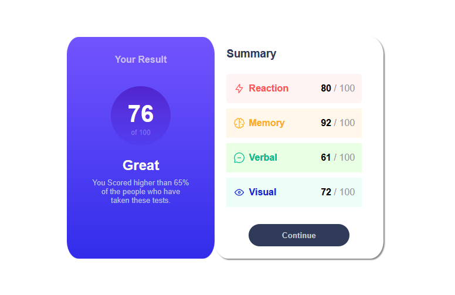
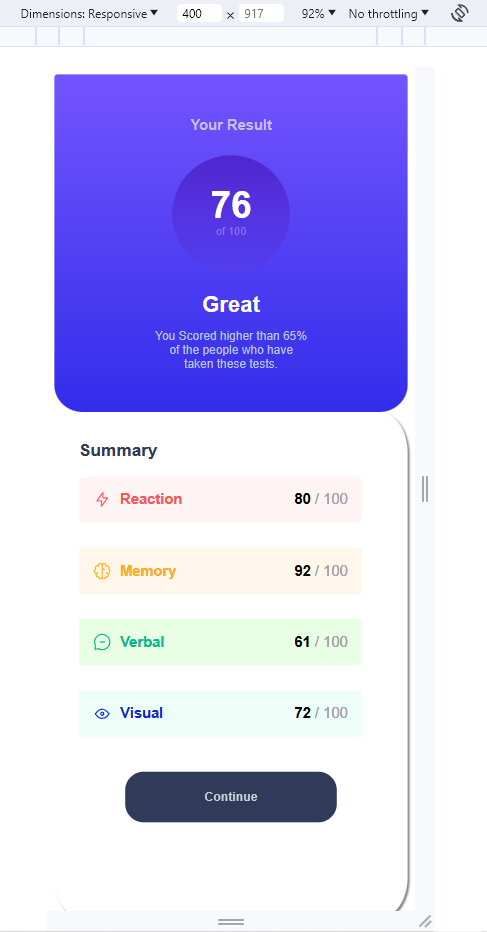

# Frontend Mentor - Results summary component solution

This is a solution to the [Results summary component challenge on Frontend Mentor](https://www.frontendmentor.io/challenges/results-summary-component-CE_K6s0maV). Frontend Mentor challenges help you improve your coding skills by building realistic projects. 

## Table of contents

- [Overview](#overview)
  - [The challenge](#the-challenge)
  - [Screenshot](#screenshot)
  - [Links](#links)
- [My process](#my-process)
  - [Built with](#built-with)
  - [What I learned](#what-i-learned)
  - [Continued development](#continued-development)
- [Author](#author)

## Overview

### The challenge

Users should be able to:

- View the optimal layout for the interface depending on their device's screen size (**Acheived**)
- See hover and focus states for all interactive elements on the page (**Acheived**)
- **Bonus**: Use the local JSON data to dynamically populate the content (**Not Acheived**)

### Screenshot

**Web Final Solution Below**


**Mobile Final Solution Below**


### Links

- Live Site URL: [](https://jamesparsaie.github.io/FrontendChallege-Summary/)

## My process

### Built with

- Semantic HTML5 markup
- CSS custom properties
- Flexbox
- Mobile-first workflow

### What I learned

As I continue to work through these challenge projects offered by Frontend Mentor, I have gained invaulable experience in desiging objects based on inspiration from scratch. Specifically in the area of mobile first development, I have learned the value and skills to address responsiveness in webpages
and ensuring a consistent and enjoyable experience for users who are navigating a webpage

Some cool things I learned
  - I learned a very interesting way to make a div that represents a perfect circle to represent data (see the score div on the webpage)
```css
.circleScore {
    display: flex;
    flex-direction: column;
    align-items: center;
    width: 7vw;
    height: 7vw;
    border-radius:50%;
    margin-top: 8%;
    background-color: #452cdd;
    background: linear-gradient(#5025ce, #5534e1, #523def)
}
```
 - Additionally, I gained experience further in developing mobile based viewing via the @media tag in CSS

```css
@media (max-width: 768px) {

}
```

### Continued development

Use this section to outline areas that you want to continue focusing on in future projects. These could be concepts you're still not completely comfortable with or techniques you found useful that you want to refine and perfect.

## Author

- Website - [Add your name here](https://www.your-site.com)
- Frontend Mentor - [@yourusername](https://www.frontendmentor.io/profile/yourusername)
